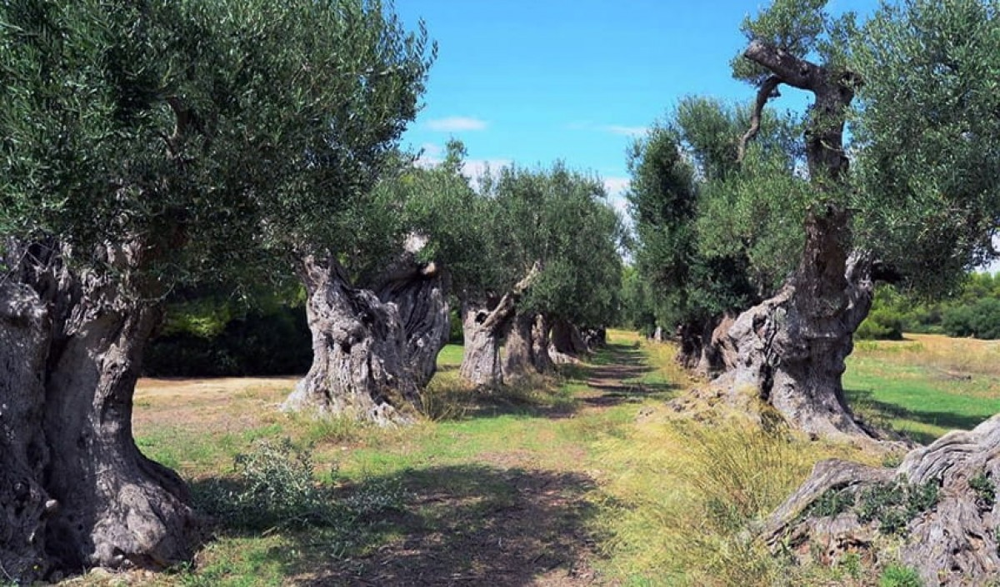
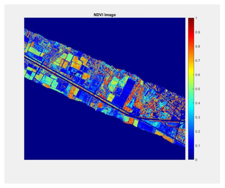
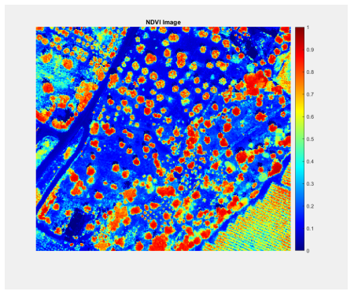
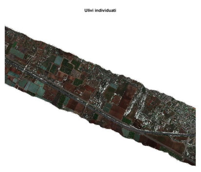
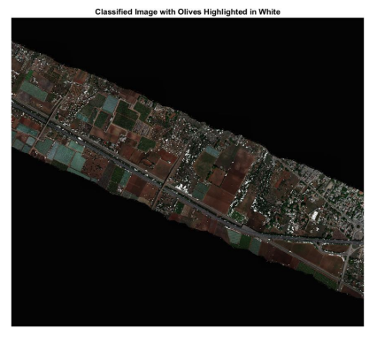

# Hyperspectral Image Processing for Olive Tree Classification

This project involves the classification of olive trees and the analysis of vegetation indices using hyperspectral images in MATLAB. The primary goal is to assess the health of olive trees, particularly in the region of Mola di Bari, using advanced image processing techniques.

## Table of Contents
- [Introduction](#introduction)
- [Data](#data)
- [Methodology](#methodology)
- [Vegetation Indices](#vegetation-indices)
- [Results](#results)
- [Contributing](#contributing)
- [License](#license)

## Introduction
Olive trees (*Olea europaea L.*) are iconic in Mediterranean regions, especially in Puglia, Italy, where olive oil production is a significant agricultural activity. However, recent threats such as the spread of the *Xylella fastidiosa* bacterium have jeopardized the health of olive trees. 

  

This project leverages hyperspectral imaging technology to detect the health of olive trees. Hyperspectral images provide a detailed spectral signature for each pixel, revealing chemical composition and enabling precise analysis.

## Data
- **Hyperspectral image**: An ENVI `.img` file representing a section of the countryside in Mola di Bari.
- **Shapefile**: Used to locate olive groves within the region.
- **Software**: MATLAB, including libraries for image processing and vegetation analysis.

## Methodology
1. **Image Preprocessing**:
   - Loaded and preprocessed hyperspectral data using MATLAB.
   - Removed noise and applied contrast stretching for better visualization.
2. **Olive Tree Classification**:
   - Manual selection of pixels representing olive tree canopies.
   - **Support Vector Machine (SVM)**: Trained on the spectral signatures of the selected pixels.
   - **Spectral Angle Mapper (SAM)**: An alternative classification method that computes the spectral similarity between selected pixels and reference signatures.
3. **Vegetation Indices Calculation**:
   - Indices like NDVI, SAVI, MSAVI, and GCI were calculated to evaluate the health of olive trees.
4. **Reflectance Analysis**:
   - Reflectance values for the selected pixels were computed and plotted to identify healthy or stressed olive trees.

## Vegetation Indices
The following vegetation indices were calculated to monitor the health and growth of olive trees:
- **NDVI (Normalized Difference Vegetation Index)**: Measures plant health based on near-infrared and red light reflectance.

  
  

- **SAVI (Soil Adjusted Vegetation Index)**: Reduces soil brightness influence, improving vegetation detection.
- **MSAVI (Modified Soil-Adjusted Vegetation Index)**: Compensates for soil impact in areas with sparse vegetation.
- **GCI (Green Chlorophyll Index)**: Analyzes the chlorophyll content in plants.

## Results
- **Olive Tree Classification**:
   - SVM and SAM produced comparable results, with some variability in sensitivity to different spectral signatures.

  
  

- **Vegetation Health**:
   - Areas with high NDVI values indicated dense and healthy vegetation.
   - SAVI and MSAVI helped differentiate vegetation from soil, showing accurate classifications for olive trees.

## Contributing
If you'd like to contribute to this project, feel free to submit pull requests or suggest improvements.

## License
This project is licensed under the MIT License. See the [LICENSE](LICENSE) file for more details.
